<details>

<summary>Tips for collapsed sections</summary>

### You can add a header

You can add text within a collapsed section.

You can add an image or a code block, too.

```ruby
   puts "Hello World"
```

</details>
Here is a simple flow chart:

```mermaid
sequenceDiagram
Alice->>John: Hello John, how are you?
loop Healthcheck
    EDY->>EDY: CORIOGRAFO
end
Note right of John: Rational thoughts!
ABISAEL-->>AGNES: DANÇA!
JEAN->>GABRELA: How about you?
Bob-->>John: Jolly good!
BEAT-->>JAM: CORIOGRAFIA

```


